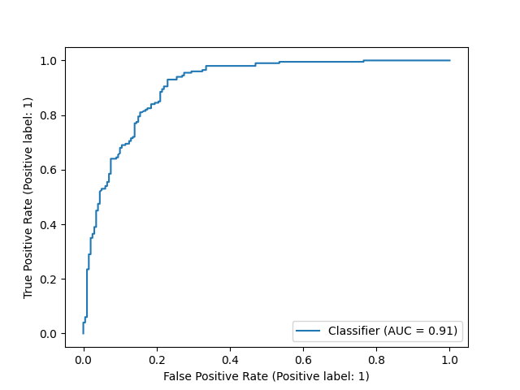

In collaboration with [WIFS](https://wifs2022.utt.fr/), TU Delft CYS is organizing a competition in the domain of signal processing, combining biometrics and secure computation. Specifically, competitors are tasked to create a **private odor-based access control system** that matches encrypted human samples with permitted encrypted samples on an external database. The sensitive nature of the biometric samples requires them to be encrypted both at rest and in transit. At the same time, to prevent long waiting times, the access control mechanism is supposed to answer queries within only a second.

[Register here!](https://forms.office.com/Pages/ResponsePage.aspx?id=TVJuCSlpMECM04q0LeCIezoA7-5OJkxKgUWsouHTGZtUNzJJNlVCQ1VHNVA0UU9FQVJDSUgwU0xRSy4u)

## Story
For years now, company A has used a very traditional form of access control: They had dogs sniff each passerby, barking if the dog recognized them. This worked great when the company had 10 employees, but things became harder for a 100; while the dogs certainly enjoyed the increased attention, they certainly took longer to bark. Now, the company has close to 1000 employees, and the dogs are having a hard time keeping track of all the different odors. So, in 2022, this company is going high-tech! E-noses replace the dogs, who from now on get to take pets for free.

The access control system based on e-noses is provided by company B, which also serves many other clients. Since they are storing a significant amount of sensitive biometric data, they promise that all data, both at rest and in transit, is encrypted.

## Objective
The primary objective is to **maximize** the area-under-curve of the receiver operating curve (**ROC-AUC**) of the binary classification (access denied / access granted). This is the metric we use to decide the winners. In the case of a tie (up to 3 places behind the comma), we look at the run time. There are several constraints:

- The total run time for a query must take less than one second, otherwise, it is counted as incorrect. *We set a simulated bandwidth of 1 megabyte/second, so you can calculate the time it costs to transmit ciphertexts.*
- Enrolling all users must take at most 30 minutes.
- The server must not be able to learn any information from the input it receives. *In other words, the input to the server must be computationally indistinguishable from any other input.*
- ~~Each e-nose has a distinct key, with which all its queries are encrypted. *In other words, an e-nose cannot decrypt another e-nose’s images.*~~
- Each query requires only one interaction: The e-nose queries the server, and the server sends one response to the door.
- The cryptographic parameters satisfy at least _128 bits of security_ ([see the homomorphic encryption standard](https://homomorphicencryption.org/standard/)).

The server is expected to return a value that the client will interpret as ‘true’ if it is above/below an arbitrary threshold, and ‘false’ if it falls on the other side of the threshold. To compute the ROC-AUC one does not have to specify this threshold, so it is also not relevant whether these values lie between 0-1 or in any other range.

## Evaluation
The server will be populated with a database of 800 people’s odor measurements; 3 samples each. During the evaluation, each e-nose will send 400 queries of _encrypted_ odor measurements and their _supposed_ user ID to the server. 50% of the test samples should grant access, 25% should deny access and will originate from other people in the database, and the remaining 25% should deny access and originate from people outside the database. The supposed user ID is always one from the database. All solutions will be evaluated on the same freshly-generated test data.

The final evaluation will take place on a recent-generation vCPU running a single thread. We will cut short solutions that take longer than 30 minutes to enroll all users, and longer than 15 minutes to run the queries.

## Data & baseline solution
For this competition, all data is artificially generated to resemble 'human' odors measured using [gas chromatography](https://en.wikipedia.org/wiki/Gas_chromatography). Note that **we do not offer any guarantees about how realistic these samples are**, although we certainly try to.

[**The data and baseline solution are now available in the `data_baseline` folder!**](data_baseline)
### Data
The data is split into two files. The file called `chromatograms.csv` contains 5000 odor samples of 1000 users (5 per user). The file called `user_ids.csv` denotes the corresponding user IDs in the same order. Note that in the final evaluation, the solution will be evaluated on different files.

### Baseline solution
We provide a baseline solution written in python (for accessibility) using the BFV cryptosystem. The solution uses PCA and measures the total square distance to the enrolled samples belonging to the supposed user ID. To limit the magnitude of encrypted values, we disregard most of the values in the principal components, we perform downscaling, and quantization.

Please find the dependencies in `requirements.txt`. We encourage participants to work with any programming language of their choice (which are perhaps more performant), so this baseline is nothing more than an example.

At the end of the baseline we compute the ROC-AUC, and the script outputs an ROC plot that looks somewhat like the graph below. As you can see, the baseline achieves an AUC of approximately 0.91, but there is certainly room for improvement!

## Prizes
1st place: 500 euros  
2nd place: 250 euros  
3rd place: 125 euros  

## Timeline
**1st of July:** Kickoff!  
**8th of July:** Data & baseline online.  
**1st of September:** Submission system opens.  
**1st of October:** Submission deadline & [early registration deadline for WIFS](https://wifs2022.utt.fr/registration).  
**12th-16th of December:** Results announced at WIFS.  

## Submitting
> We will include details on the submission format and a submission form at a later time.

## Frequently-asked questions
**Why are you targeting odors as a biometric?**  
It was not an option for us to generate a new real-life dataset, so we had to resort to generating artificial data. For biometrics like fingerprints, faces, and iris scans, there are public generators available. To level the playing field we decided to create a new data generation pipeline for another biometric, and to keep it hidden until the results are announced.

**Will the winning teams have their work published?**  
The competition ends after the submission deadline for WIFS, but we encourage (and will work together with) the winning teams to summarize their work in a submission to [IEEE T-IFS](https://ieeexplore.ieee.org/xpl/RecentIssue.jsp?punumber=10206).

**Can our institution register multiple teams?**  
Yes! The only rule we enforce here is that each person only takes part in one team.

**Before it said there were multiple e-noses, but now there's only one?**  
That's right. To make the task simpler, evaluation easier, and allow for the use of a larger variety of libraries, we decided that all samples will originate from the same e-nose.

## Contacts
This competition is organized by the [CYS group](https://www.tudelft.nl/cybersecurity/) of Delft University of Technology.
Please feel free to contact us at [cyscompetition@tudelft.nl](mailto:cyscompetition@tudelft.nl) with questions regarding this competition.
